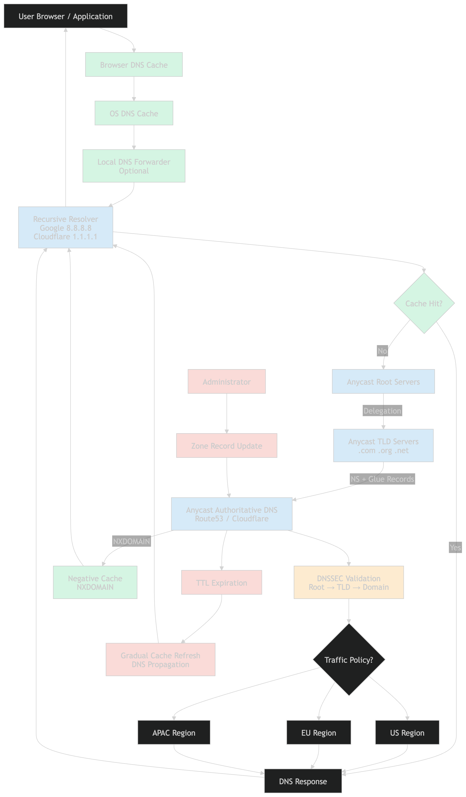

# DNS for Senior System Design Interviews



## 1. What DNS Really Is

Most engineers describe DNS as:

> DNS converts domain names into IP addresses.

While technically correct, this definition is too simplistic for system design interviews.

A more accurate definition is:

> DNS (Domain Name System) is a globally distributed, hierarchical, highly cached, eventually consistent key-value database that maps names to resource records.

DNS stores many types of records, not just IP addresses.

| Name                                       | Record Type | Value            |
| ------------------------------------------ | ----------- | ---------------- |
| example.com                                | A           | 192.0.2.10       |
| example.com                                | AAAA        | 2001:db8::10     |
| [www.example.com](http://www.example.com/) | CNAME       | example.com      |
| example.com                                | MX          | mail.example.com |
| \_sip.\_tcp.example.com                    | SRV         | Service endpoint |

DNS is one of the largest distributed systems ever built, serving enormous query volumes across the internet every day.

## 2. DNS Hierarchy

DNS is organized as a hierarchical namespace.

```
                .
                │
        ┌───────┴───────┐
        │               │
      .com            .org
        │               │
    example.com    wikipedia.org
        │
      www
```

Each level delegates responsibility to the level below it.

This delegation model enables DNS to scale globally without requiring a central database.

## 3. DNS Actors

There are four primary actors involved in DNS resolution.

### 3.1 Client

The client is the software requesting DNS resolution.

Examples:

- Chrome
- Firefox
- JVM applications
- Mobile applications
- Kubernetes Pods

The client typically delegates DNS resolution to a recursive resolver.

### 3.2 Recursive Resolver

A recursive resolver performs lookups on behalf of clients.

Examples:

- ISP DNS servers
- Google Public DNS (8.8.8.8)
- Cloudflare DNS (1.1.1.1)

Responsibilities:

- Cache DNS records
- Perform recursive lookups
- Reduce authoritative DNS load
- Validate DNSSEC signatures
- Improve lookup latency

Resolvers are the primary reason DNS scales globally.

### 3.3 Root Nameservers

Root servers sit at the top of the DNS hierarchy.

A common misconception is that root servers know the IP address of every website.

They do not.

Instead, they know where Top-Level Domain (TLD) nameservers are located.

Example:

```

Query: example.com
Response: Ask the .com nameservers

```

There are:

- 13 logical root server identities (A–M)
- Hundreds of Anycast instances worldwide

### 3.4 TLD Nameservers

TLD nameservers manage domains within a specific top-level domain.

Examples:

- .com
- .org
- .net
- .dev

A TLD server does not know a domain's final IP address.

Instead, it returns the authoritative nameservers for that domain.

Example:

```

example.com

NS ns1.provider.com
NS ns2.provider.com

```

### 3.5 Authoritative Nameservers

Authoritative nameservers are the source of truth for a domain.

Examples:

- Amazon Route 53
- Cloudflare
- NS1
- Akamai

Responsibilities:

- Store zone data
- Serve DNS records
- Publish TTL values
- Support traffic steering policies

## 4. Complete DNS Resolution Flow

DNS resolution follows a hierarchical lookup process.

```

Browser
   │
   ▼
Browser Cache
   │
   ▼
OS DNS Cache
   │
   ▼
Local DNS Forwarder (Optional)
   │
   ▼
Recursive Resolver
   │
   ├──────── Cache Hit
   │              │
   │              ▼
   │         Return Answer
   │
   └──────── Cache Miss
                   │
                   ▼
             Root Server
                   │
                   ▼
              TLD Server
                   │
                   ▼
        Authoritative Server
                   │
                   ▼
            DNS Response
                   │
                   ▼
          Resolver Cache
                   │
                   ▼
                Client

```

### Important Interview Point

The sequence:

```

Root → TLD → Authoritative

```

does **not** occur on every lookup.

It occurs only when the recursive resolver cannot satisfy the request from cache.

Most production DNS queries are served directly from caches.

## 5. Registrar vs Registry vs DNS Provider

This distinction appears frequently in interviews.

### Registrar

A registrar sells domain registrations to customers.

Examples:

- Namecheap
- GoDaddy

Responsibilities:

- Domain registration
- Renewals
- Transfers

### Registry

A registry operates a top-level domain.

Examples:

- Verisign (maintains .com database)
- Public Interest Registry (maintains .org database)

Responsibilities:

- Maintain TLD databases
- Publish TLD zone files
- Delegate authority to nameservers

### DNS Hosting Provider

A DNS hosting provider runs authoritative nameservers.

Examples:

- Route53
- Cloudflare DNS
- NS1

The registrar and DNS provider may be different organizations.

## 6. How DNS Updates Actually Work

Suppose a record changes:

```

Before

example.com
A → 1.1.1.1

After

example.com
A → 2.2.2.2

```

### Update Process

1. Administrator modifies the DNS record.
2. Authoritative DNS servers update their zone data.
3. New queries to authoritative servers immediately receive the new value.
4. Recursive resolvers continue serving cached answers.
5. Cached entries expire according to TTL.
6. New lookups gradually observe the updated value.

### What "DNS Propagation" Really Means

A common misconception is that DNS changes are physically replicated across the internet.

In reality:

> DNS propagation is usually cache expiration rather than global record replication.

This explains why some users see updates immediately while others continue receiving old answers.

## 7. TTL Trade-Offs

TTL (Time To Live) controls how long DNS responses remain cacheable.

### Low TTL

Example:

```

TTL = 60 seconds

```

Advantages:

- Fast failover
- Fast blue-green deployments
- Rapid migrations

Disadvantages:

- Higher query volume
- Lower cache efficiency
- Increased authoritative load

### High TTL

Example:

```

TTL = 86400 seconds

```

Advantages:

- Excellent cache efficiency
- Reduced DNS costs
- Lower authoritative traffic

Disadvantages:

- Slow failover
- Slow migrations

### Common Production Values

| Use Case              | Typical TTL      |
| --------------------- | ---------------- |
| Critical Services     | 60–300 seconds   |
| Standard Services     | 300–3600 seconds |
| Stable Infrastructure | 86400 seconds    |

## 8. Glue Records

Glue records solve a circular dependency problem.

Suppose:

```

example.com
NS ns1.example.com

```

To resolve `example.com`, we need the IP address of `ns1.example.com`.

However:

```

ns1.example.com

```

is itself inside the same zone.

This creates a bootstrap problem.

### Solution

The TLD provides a glue record.

```

NS ns1.example.com

Glue:
203.0.113.10

```

The resolver receives both:

```

NS ns1.example.com
A 203.0.113.10

```

allowing resolution to continue.

## 9. DNSSEC

DNS was originally designed without authentication.

An attacker could potentially forge responses.

Example:

```

Resolver asks:
example.com ?

```

Attacker responds:

```

example.com → malicious IP

```

### DNSSEC Solution

DNSSEC introduces cryptographic signatures.

Validation chain:

```

Root Zone Key
      │
      ▼
TLD Zone Key
      │
      ▼
Domain Zone Key
      │
      ▼
Signed RRsets

```

The resolver validates signatures through a chain of trust anchored at the root zone.

### DNSSEC Provides

- Authenticity
- Integrity

### DNSSEC Does Not Provide

- Encryption
- Privacy

## 10. DoH vs DoT

DNSSEC protects authenticity.

DoH and DoT protect confidentiality.

### DNS over TLS (DoT)

```

TLS
 └── DNS

```

Port:

```

853

```

### DNS over HTTPS (DoH)

```

HTTPS
 └── DNS

```

Port:

```

443

```

### Benefits

- Encrypts DNS queries
- Prevents local network snooping
- Reduces ISP visibility into DNS traffic

### DoH vs DoT ?

- For maximum privacy and censorship resistance: DoH.
- For clean protocol design and easier network management: DoT.

## 11. Anycast

Anycast is one of the most important DNS scaling techniques.

Used by:

- Root servers
- TLD servers
- Major authoritative DNS providers
- Public recursive resolvers

### Architecture

```

           Same IP
               │
     ┌─────────┼─────────┐
     │         │         │
     ▼         ▼         ▼
   Tokyo    London   Virginia

```

Each site advertises the same IP address through BGP.

Internet routing directs traffic to the best available path.

### Benefits

- Low latency
- DDoS resilience
- Geographic redundancy
- High availability

## 12. Negative Caching

DNS caches failures as well as successful lookups.

Example:

```

NXDOMAIN

```

Meaning:

```

The requested name does not exist.

```

Resolvers cache this result using values derived from the zone's SOA record (RFC 2308).

### Operational Impact

Suppose:

1. A record is accidentally deleted.
2. Clients receive NXDOMAIN.
3. The record is restored immediately.

Clients may still experience failures until negative cache entries expire.

## 13. DNS-Based Traffic Engineering

Modern DNS providers do far more than return static IP addresses.

Examples:

- Route53
- Cloudflare Load Balancing
- Akamai Edge DNS

Capabilities include:

- Weighted routing
- Latency routing
- Geolocation routing
- Health-check failover
- Blue-green deployments
- Canary releases
- Disaster recovery

DNS therefore acts as a global traffic-control layer.

```

User
 │
 ▼
DNS Provider
 │
 ├── US Users ─────► US Region
 │
 ├── Europe Users ─► EU Region
 │
 └── Asia Users ───► APAC Region

```

# Common Senior-Level DNS Interview Questions

### Explain recursive vs authoritative DNS.

### Why are TTL values important?

### What causes DNS propagation delays?

### What are glue records?

### How does DNSSEC work?

### DNSSEC vs DoH vs DoT?

### Why does Anycast improve DNS performance?

### How do Route53 and Cloudflare perform traffic steering?

### What is negative caching?

### How would you design highly available DNS for a global service?

# Senior Interview Summary

DNS is best understood as:

> A globally distributed, hierarchical, highly cached, eventually consistent naming database that provides delegation, replication, fault tolerance, traffic steering, and global-scale name resolution.

The concepts most frequently expected in senior system design interviews are:

1. Recursive vs Authoritative DNS
2. DNS Resolution Flow
3. Root → TLD → Authoritative Delegation
4. Registrar vs Registry vs DNS Provider
5. TTL and Caching Trade-offs
6. DNS Propagation
7. Glue Records
8. DNSSEC
9. DoH vs DoT
10. Anycast
11. Negative Caching
12. DNS-Based Traffic Engineering

If you can explain these topics clearly, including their operational trade-offs, you are generally operating at the expected DNS depth for senior backend and system design interviews.
