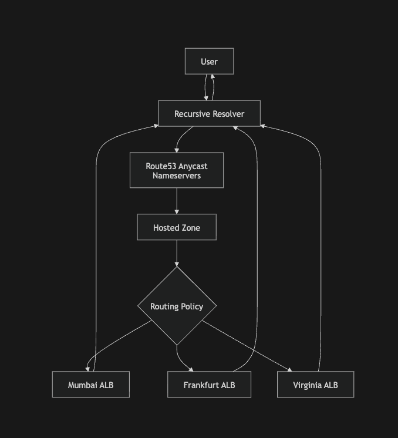

# Amazon Route 53 for System Design Interviews

### What Route 53 Really Is

Most engineers think of Route 53 as:

> AWS's DNS service.

For system design interviews, a better definition is:

> Route 53 is a globally distributed authoritative DNS service that also provides domain registration, health checking, traffic routing, and DNS-based traffic engineering.

Think of it as:

```
Traditional DNS Server
        +
Global Traffic Controller
        +
Health Monitoring System
        +
Domain Registrar
```

## Core Components

### 1. Hosted Zone

A Hosted Zone is the DNS database for a domain.

Example:

```
example.com
```

Hosted Zone contains:

```
example.com       A       1.2.3.4
www.example.com   CNAME   example.com
api.example.com   A       5.6.7.8
```

Think of it as:

```
MySQL Database
        ↓
DNS Zone Database
```

### 2. DNS Records

Route 53 supports standard DNS record types.

Common ones:

| Record | Purpose                 |
| ------ | ----------------------- |
| A      | IPv4 Address            |
| AAAA   | IPv6 Address            |
| CNAME  | Alias another name      |
| MX     | Mail Server             |
| TXT    | Verification / Metadata |
| NS     | Nameservers             |
| SRV    | Service Discovery       |

### 3. Alias Records (Custom feature, not part of DNS spec)

One of Route 53's most important features.

Normal DNS:

```
www.example.com
    CNAME
cloudfront.net
```

Root domain cannot legally be a CNAME according to DNS standards.

Route 53 introduces:

```
Alias Record
```

Example:

```
example.com
        ↓
CloudFront Distribution / ALB / ELB / S3 bucket (AWS resolves this to an IP dynamically)
```

Benefits:

- Works at zone apex
- No additional DNS lookup
- AWS-managed target tracking

Senior interview point:

> Alias records are an AWS-specific extension that behave similarly to CNAMEs while avoiding DNS limitations at the root domain.

## Route 53 Resolution Flow

```
Client
   │
   ▼
Recursive Resolver
   │
   ▼
Route53 Anycast Nameserver
   │
   ▼
Hosted Zone
   │
   ▼
Routing Policy Evaluation
   │
   ▼
Selected Endpoint
   │
   ▼
DNS Response
```

Unlike traditional DNS:

```
Query
    ↓
Static IP
```

> Route 53 may dynamically decide which answer to return.

## Health Checks

Route 53 can monitor endpoints.

Example:

```
Primary API
10.0.0.1
```

Health Check:

````
GET /health```
````

If unhealthy:

```
Do not return this endpoint
```

This enables DNS-based failover.

## Routing Policies

This is the most commonly tested Route 53 topic.

### 1. Simple Routing

Always return the same answer.

```
api.example.com
↓
10.0.0.1
```

Use when:

- Single application
- No failover needed

### 2. Weighted Routing

Split traffic across multiple endpoints.

```
api.example.com

70% → Version A
30% → Version B
```

Useful for:

- Canary deployments
- A/B testing
- Gradual rollouts

### 3. Latency-Based Routing

Route 53 selects the region with lowest AWS-measured latency.

```
User
↓
Mumbai

Route53
↓
ap-south-1
```

instead of:

```
us-east-1
```

Goal:

- Lowest latency

### 4. Geolocation Routing

Routing based on user location.

```
India
↓
india.example.com

Europe
↓
eu.example.com
```

Used for:

- Compliance
- Localization
- Country-specific experiences

### 5. Failover Routing

Primary/Secondary architecture.

```
Primary
    ↓
Healthy?
```

If yes:

```
Return Primary
```

If no:

```
Return Secondary
```

Example:

```
Mumbai Region
       ↓ fails

Bangalore Region
```

> Classic disaster recovery setup.

### 6. Multi-Value Answer Routing

Returns multiple healthy IPs.

```
10.0.0.1
10.0.0.2
10.0.0.3
```

If one fails:

```
10.0.0.1 removed
```

Remaining endpoints continue serving traffic.

Provides lightweight load distribution.

## Route 53 v/s Load Balancers

A common interview confusion.

| Component                   | Decides         | Purpose                                                                                                 |
| --------------------------- | --------------- | ------------------------------------------------------------------------------------------------------- |
| **Route 53**                | Which region?   | Directs traffic to the appropriate geographic region.                                                   |
| **Route 53**                | Which endpoint? | Chooses the target endpoint based on routing policies (latency, geolocation, failover, weighted, etc.). |
| **Load Balancer (ALB/NLB)** | Which server?   | Distributes requests among available servers.                                                           |
| **Load Balancer (ALB/NLB)** | Which pod?      | Routes traffic to the appropriate container/pod in containerized environments.                          |
| **Load Balancer (ALB/NLB)** | Which instance? | Selects the specific compute instance that will handle the request.                                     |

- Route 53 performs Region Selection
- ALB/NLB performs Instance Selection


